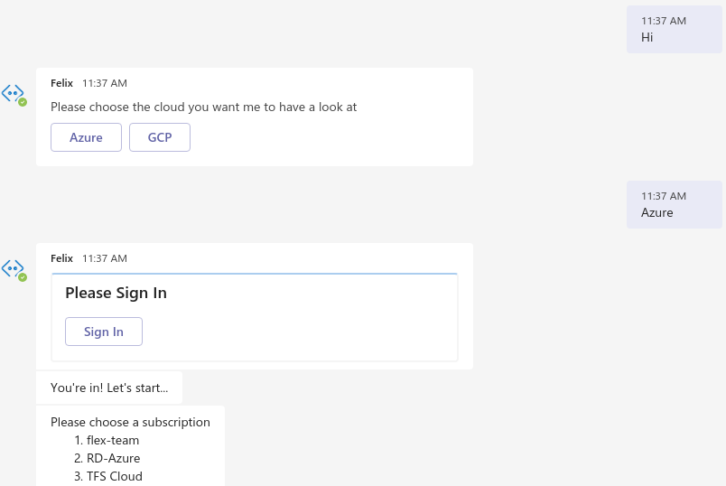
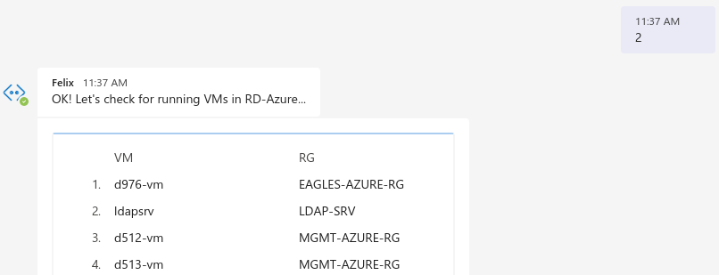
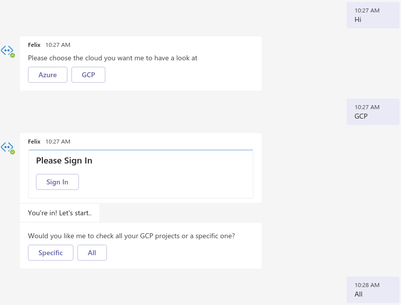
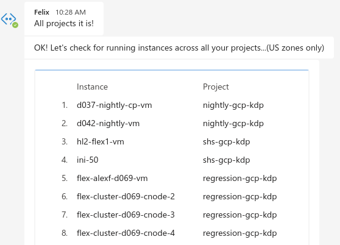

# Felix

Felix is a bot that helps you monitor your cloud resources

* Currently supports:

  * Azure
  * GCP

**Deployment**

* This section covers the deployment of the bot in Azure using Azure Bot Service
* You should have a valid Azure subscription for completing this process

1. [Create](https://portal.azure.com/#blade/Microsoft_AAD_RegisteredApps/ApplicationsListBlade) an Application Registration for the bot. Fill in the details as explained [here](https://docs.microsoft.com/en-us/azure/bot-service/bot-builder-authentication?view=azure-bot-service-4.0&tabs=csharp%2Caadv2#create-the-azure-ad-identity-provider)
2. [Create](https://portal.azure.com/#create/Microsoft.AzureBot) the bot in Azure Bot Service. Provide the Application ID & password from previous step where needed.
3. As the bot expects AAD and/or Google as identity provider, add at least one of them as "OAuth Connection" in your bot configuration [here](https://portal.azure.com/#blade/Microsoft_Azure_ProjectOxford/AppliedAIHub/BotServices)
4. [Create](https://portal.azure.com/#create/Microsoft.WebSite) a web app for hosting the bot. Use infromation (e.g., secrets, ids) from previous steps where needed. Also, define [ENV vars](config.py) for the bot's web app containing the "OAuth Connection" info from previous step.
5. Deploy bot by zipping all content of main directory and submitting it with "az webapp deployment source config-zip --resource-group \<rg\> --name \<web-app-name\> --src deploy.zip" command
6. Integrate with your MS Teams app by [creating a manifest](/teams_app_manifest/create_teams_manifest.sh) and [load it to Teams](/images/teams_instructions.jpg)

**Azure**:

**GCP**:

